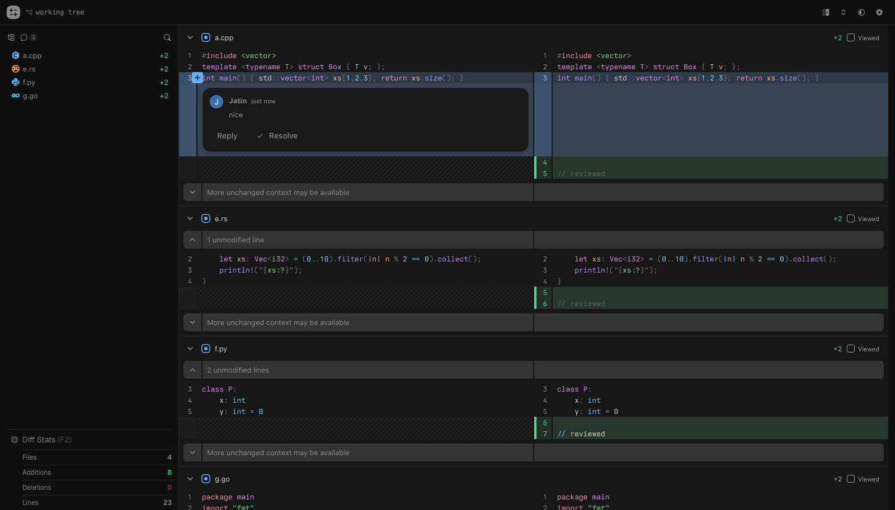

<h1 align="center">Hunkyard</h1>

<p align="center">
  Code review that works on a pull request, a local branch,<br>
  or whatever you have not committed yet.
</p>

<p align="center">
  <a href="https://github.com/jatindotdev/hunkyard/actions/workflows/ci.yml"></a>
  <a href="https://github.com/jatindotdev/hunkyard/releases/latest"></a>
  <a href="LICENSE"></a>
  
</p>



GitHub's review UI is slow on large diffs and can only review something that is
already a pull request. Hunkyard reviews any of them, runs entirely on your
machine, and renders diffs of a size the GitHub UI gives up on.

Open it and pick what to review: browse for a repository, choose a branch or a
range inside it, or paste a pull request URL. The `hunk` CLI is a shortcut for
when you are already in a terminal, not the only way in.

## Install

```bash
curl -fsSL https://raw.githubusercontent.com/jatindotdev/hunkyard/main/scripts/install.sh | sh
```

One executable with the Bun runtime, the server and the whole client compiled
into it. Nothing to install alongside it: no Node, no Bun, no `node_modules`.
`HUNK_VERSION` pins a release, `HUNK_INSTALL_DIR` chooses where it lands.

## Use

```bash
hunk                    # review what you have not committed
                        # (or open the picker, outside a repository)
hunk --staged           # review what you are about to commit
hunk main...my-branch   # review a branch as a PR would show it
hunk HEAD~3             # review the last three commits
hunk owner/repo#123     # review a pull request

hunk status             # what is running, and which repositories it serves
hunk stop               # stop it
hunk forget <id>        # drop a repository from that list (--all for every one)
```

`hunk` opens a browser and returns. It serves at
`http://hunkyard.localhost:4865`, in the background, and keeps running until you
stop it, so the second review of the day costs 44ms rather than a restart. It
serves every repository you have opened, so running `hunk` in another one just
works. Use `--foreground` to hold the terminal instead.

Run it outside a repository and it opens the picker rather than failing, so
there is somewhere to go from a browser bookmark with no terminal involved.

<details>
<summary>Starting it at login, so it is simply there</summary>

```bash
hunk install     # login agent, and the port-80 forwarder (one sudo)
hunk uninstall   # removes both
```

The forwarder is half of it because the bare host is the point: two URLs for one
app would split browser storage. See below.

Without this the server starts on demand, which means running `hunk` at least
once per boot. With it, `http://hunkyard.localhost` is a bookmark that works
cold.

`hunk stop` still stops it; the agent starts it again at your next login rather
than immediately. `hunk status` says whether the agent is installed, and where
its output goes when it fails to start.
</details>

<details>
<summary><b>git hunk</b> works too</summary>

The installer puts a `git-hunk` symlink next to the binary, with a man page, so
`git hunk` and `git hunk --help` both work. Git resolves the second as
`git help hunk`, which reads a man page rather than running the binary, so
without one it would fail.
</details>

<details>
<summary>The binaries are large, about 75MB</summary>

Each one embeds the Bun runtime and the whole client. They are uncompressed, so
one downloaded from the releases page runs after a `chmod`. GitHub does not
compress release assets in transit either, so that is the size on the wire.
</details>

<details>
<summary>Serving <code>hunkyard.localhost</code> with no port</summary>

Port 80 needs root and the server does not, so only the listener runs
privileged: `hunk install` adds a forwarder from `127.0.0.1:80` to the server's
port, as a LaunchDaemon on macOS or a systemd unit on Linux. The server does not
know it exists, and connections fail when no server is running exactly as they
would without it.

Once the forwarder answers, the bare host is the canonical origin and a page
opened on `:4865` redirects to it. Browser storage is per-origin, so without
that your viewed state would depend on which of the two URLs you happened to
open. The redirect is gated on the forwarder actually answering, so removing it
leaves the app serving on its own port rather than pointing at a dead one.

Windows has no privileged-port concept, so the forwarder is a no-op there and
the bare host is not available yet.
</details>

<details>
<summary>An unrelated tool is also called <code>hunk</code></summary>

If you already have one on your PATH, whichever directory comes first decides
which runs. The installer names the one that wins rather than leaving you to
find out.
</details>

## What it does

**Open anything from the browser.** A filesystem browser for finding a
repository, a list of the ones you have opened before, and a picker inside each
for the working tree, the index, this branch against its base, any two refs, a
recent commit, or a revspec you type. `⌘K` moves between them without leaving
the review you are in. Pull requests stay paste-a-URL: no inbox, nothing
fetched about you.

**Reviews local work, not just pull requests.** A three-dot range is diffed
against the merge base, the same anchor GitHub uses, so a local review and the
pull request it becomes show identical line numbers. Untracked files are
synthesized into the diff without touching the index. Editing a file with the
viewer open reloads it and holds your scroll position.

**Real review threads.** Multi-line anchors, replies, resolve, and as many
drafts open at once as you like. On a pull request they are queued locally and
submitted as one review with a verdict, the way a batched GitHub review works.
On a local target they are written to `.hunkyard/review.md` in the repository,
which is readable prose with the anchors in HTML comments, so a coding agent can
read your review back.

**Remembers where you were.** Files you have marked viewed collapse and stay
collapsed across restarts, per file and per blob, so one file changing does not
discard the rest of your progress. Display preferences persist too.

**Keyboard.**

| | |
| --- | --- |
| `j` `k` | between files |
| `n` `p` | between comment threads |
| `v` | mark the current file viewed |
| `c` | comment on the selected lines |
| `⌘↵` | submit the review |
| `?` | this list |
| `F2` `F3` | diff stats, system monitor |

## Not yet

- Image and binary files render a placeholder row rather than a real diff, since
  `@pierre/diffs` has no binary handling of its own.
- No command palette. `⌘K` opens the source switcher instead.
- Only github.com and tangled.org can be pasted in. A URL from anywhere else is
  refused rather than quietly resolved to a github.com path.
- No way to share a review. It is yours, on your machine.

## Everything stays on your machine

There is no hosted service and no account. `hunk` binds loopback and serves both
the app and the data, so it is all one origin: no CORS, no pairing, no permission
prompt for reaching localhost from a public page.

A GitHub token is only needed for pull requests, and only private ones at that.
It is read from `gh auth token` or `GH_TOKEN`, stays in the server process, and
is proxied rather than handed to the browser.

Binding a port your browser can reach has three consequences, and each gets its
own answer. A page can point a hostname it controls at `127.0.0.1` and have your
browser treat its origin as ours, so the `Host` header is checked against the
names we actually answer on. A page can fire a write at the real address without
being able to read the reply, so anything that is not a GET needs an `Origin`
that is present and ours. And a page can *cause* a read even without seeing the
result, which matters for an endpoint that lists directories, so `Sec-Fetch-Site`
is refused when it is present and not ours: browsers set it, page script cannot
forge it, and `curl` and the CLI do not send it at all.

A request names a repository either by the id in the URL or by path, and any
repository on the machine is reachable. The list of repositories you have opened
is a recents list rather than a gate, so what actually stops a foreign page
reading your disk is the three checks above plus the absence of CORS headers.
`HUNKYARD_BROWSE_ROOT` confines the filesystem browser to one subtree if you
want that narrowed deliberately.

## Why `hunkyard.localhost`

RFC 6761 reserves `.localhost`, so the name resolves to `127.0.0.1` with no
`/etc/hosts` entry, and on macOS it goes through the system resolver so Safari
works too. Port **4865** is `HUNK` on a phone keypad.

The point is a stable origin. An ephemeral port would mean a new origin on every
restart, so `localStorage` would reset each time, losing viewed state and
display preferences.

## Develop

```bash
bun install
bun dev                 # http://hunkyard.localhost:4865, API included
bun run build           # client, then a binary at dist/hunk
bun run build:release   # cross-compiled binaries for every platform, plus checksums
bun test
bun run typecheck
```

CI runs the same three commands on every push, then builds the binary and smoke
tests it: health, the embedded client, and a real diff from a scratch repository.
Pushing a `v*` tag builds every target and publishes the release. `bun build
--compile` is not reproducible, so `SHA256SUMS` describes the artifacts that run
produced and nothing else.

`bun test` includes browser tests that drive real Chrome over the DevTools
Protocol (`lib/test/ui.integration.test.ts`). Bun recommends happy-dom for DOM
testing and it is right for a component in isolation, but it has no layout
engine, so `getBoundingClientRect` returns 0x0. The diff surface is virtualized
and measures item heights, and selecting lines means dragging over a gutter at a
coordinate, so those checks need a real browser. Workers do run under happy-dom,
since Bun provides real ones.

Waits are real elapsed time. `--virtual-time-budget` cannot be used here: it
advances the main thread's clock but not a worker's, and the viewer is gated on
the highlight pool booting, so under virtual time the page reaches `ready`
before the pool exists and the diff never appears.

For looking at something rather than asserting it, `scripts/drive.ts` shares the
same client:

```bash
bun scripts/drive.ts http://hunkyard.localhost:4865/local \
  drag:344,159,344,179 key:c shot:/tmp/a.png
```

## What changed from upstream

DiffsHub is a read-only viewer, deliberately a preview of what the libraries can
do: its comment layer persists nothing and assigns you a random Pierre-employee
avatar. Hunkyard keeps the rendering pipeline and replaces that layer.

- Added a local-git source: six targets, merge-base ranges, untracked-file
  synthesis, whole-file reads for hunk expansion, and SSE watch mode.
- Replaced the demo comment layer with real threads over two stores, a GitHub
  one and a local markdown one.
- Plumbed the head commit through, which no response header carried, so a review
  comment has a `commit_id` to anchor to.
- Content-addressed highlight cache keys from the blob ids in each patch's
  `index` line. Keying on the path meant a working tree kept stale highlighting,
  since its content changes while its path does not.
- Trimmed the dependency overrides to the two that are load-bearing.
  `@pierre/theming` pins shiki 4.4.1 while `@pierre/diffs` accepts `^3 || ^4`,
  which installs two copies and so two grammar registries; and `@pierre/trees`
  and `@pierre/diffs` pin different `@pierre/theming` patches while both hold
  resolved-theme state at module scope. Pinning shiki's `@shikijs/*` family
  separately did nothing, because shiki already pins it exactly.
- Ported off Next.js to Vite and Hono, then to a single Bun executable: 187MB of
  runtime dependencies down to none at all.
- Removed Berkeley Mono (commercially licensed, not redistributable) in favour of
  [Ioskeley Mono](https://github.com/ahatem/IoskeleyMono), and the bundled Pierre
  staff photos the demo comment layer used.
- Removed Vercel analytics, the demo CDN patch blobs and the `/gh` redirect stub.
- Extracted from the `pierrecomputer/pierre` monorepo: `catalog:`/`workspace:*`
  specifiers pinned to literals, moonrepo and the TS project references dropped,
  `@pierre/*` consumed from npm.

## Built on

[DiffsHub](https://diffshub.com) by
[The Pierre Computer Company](https://pierre.computer), using their
[`@pierre/diffs`](https://diffs.com) and
[`@pierre/trees`](https://trees.software) libraries for the virtualized diff
surface and file tree.

## License

Apache-2.0, inherited from upstream. See `LICENSE` for the terms and `NOTICE`
for the attribution.
